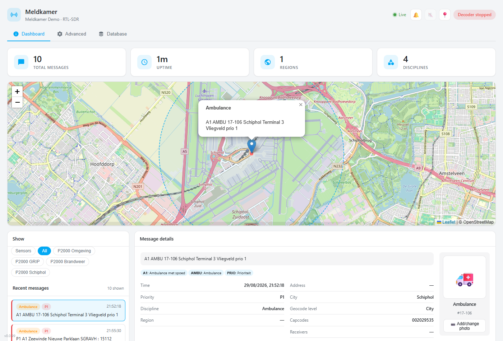
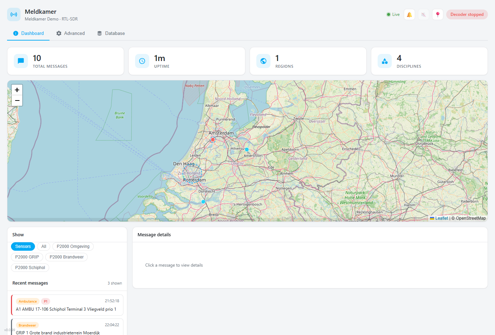
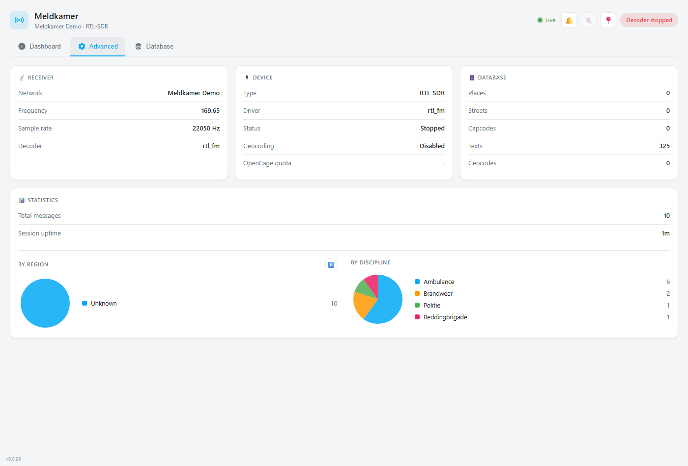
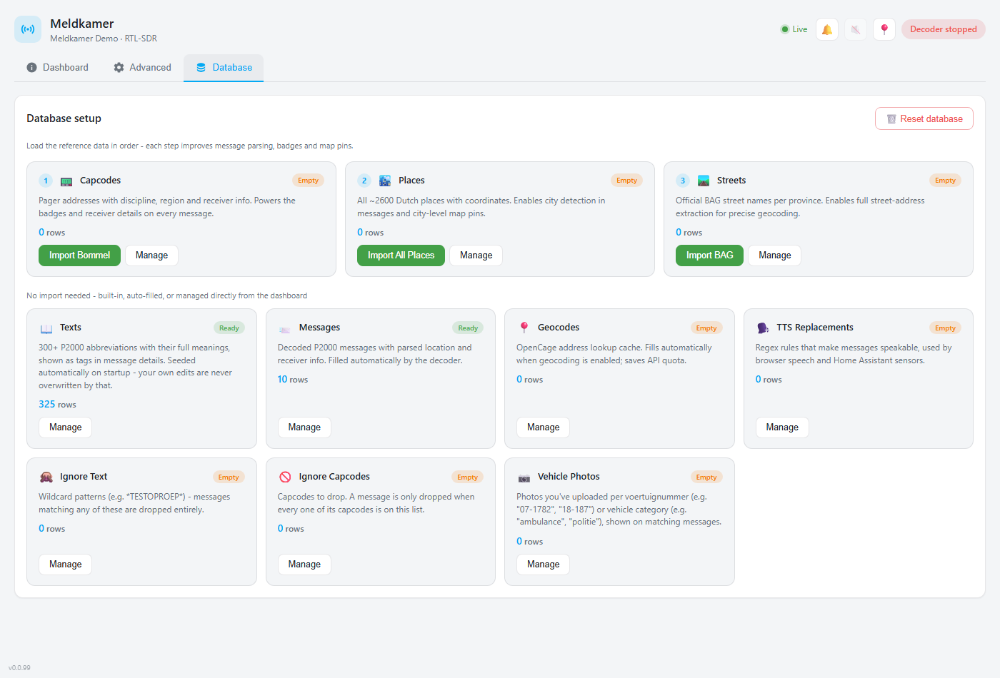

# Meldkamer

P2000 FLEX pager decoder dashboard for Home Assistant — decode Dutch emergency services messages using RTL-SDR, HackRF, or network streaming.



<details>
<summary>More screenshots (Dashboard, Advanced, Database tabs)</summary>

**Dashboard** — live map, sensor filter toggle, recent messages


**Advanced** — receiver/device status, database stats, live charts


**Database** — guided setup for reference data, auto-managed tables


</details>

## Features

- 📡 **SDR Support** — RTL-SDR, HackRF One, SoapySDR devices, or network streaming
- 🗺️ **Interactive Dashboard** — Live map, statistics, tabbed interface
- 🎯 **Sensor Filter Toggle** — Narrow the live dashboard feed to a configured sensor's criteria, or view everything
- 📍 **Geocoding** — Automatic address to coordinates (OpenCage), with city-level fallback when disabled
- 🏠 **Home Assistant Sensors** — Auto-create sensors with custom filters via REST API or MQTT
- 🗣️ **Text-to-Speech** — Browser speech reads new messages aloud (nl-NL), using editable TTS replacement rules
- 🚑 **Vehicle Classification** — Best-effort vehicle/unit recognition (ambulance, fire, helicopter, police, water rescue) with user-uploadable photos per vehicle or category
- 🔔 **Sound Notifications** — Configurable audio alerts for new messages
- 🔍 **Message Filtering** — Filter by text patterns and capcodes, managed live from the dashboard

## Network

| Network | Frequency | Protocol |
|---------|-----------|----------|
| P2000 FLEX | 169.65 MHz | FLEX |

## Web Dashboard

Access via Home Assistant sidebar → Meldkamer:

- **Dashboard Tab** — Live messages, map, charts, statistics, sensor filter toggle
- **Advanced Tab** — Receiver config, device info, database stats
- **Database Tab** — Card-based data management for every table below

### Database Tab

A fresh install starts with an **empty** database (aside from the built-in P2000 abbreviation dictionary and TTS/ignore-text defaults) — message parsing, badges, geocoding, and map pins all improve as you populate it. Capcodes, Places, and Streets are one-click imports that fetch live, free, public Dutch data over the internet, no API key needed:

- **Capcodes** — "Import Bommel" pulls ~10,000 capcodes from all 25 regions directly from [p2000.bommel.net](https://p2000.bommel.net/)
- **Places** — "Import All Places" / "Import BAG" pull city and street data from the [PDOK Locatieserver](https://www.pdok.nl/) (Dutch government address/place registry)
- **Streets** — "Import BAG" pulls official street names per province, also from PDOK

Each table gets its own card with row counts and Manage/Import actions:

| Table | Description | Import Options |
|-------|-------------|----------------|
| 📟 Capcodes | Emergency service identifiers | CSV, Bommel |
| 🏙️ Places | City/town lookup | CSV, BAG, all-places |
| 🛤️ Streets | Street address geocoding | CSV, BAG |
| 📖 Texts | P2000 abbreviation dictionary | Built-in, CSV |
| 📨 Messages | Received P2000 messages | — (filled automatically) |
| 📍 Geocodes | OpenCage address lookup cache | — (filled automatically) |
| 🗣️ TTS Replacements | Regex rules for speakable text-to-speech | CSV |
| 🙈 Ignore Text | Wildcard patterns to drop matching messages | CSV |
| 🚫 Ignore Capcodes | Capcodes to drop | CSV |
| 📷 Vehicle Photos | Photos you've uploaded per voertuignummer/category | — (upload via message detail or +Add) |

Click "Manage" on any card to view/edit/delete that table's rows.

## Configuration

### Receiver Settings

| Option | Description |
| ------ | ----------- |
| `receiver.type` | Receiver type: `rtl-sdr`, `hackrf`, `soapysdr`, `network` |
| `receiver.network_host` | IP address for network receiver (e.g., `192.168.1.100`) |
| `receiver.network_port` | Port for network receiver (default: `1234`) |
| `receiver.sdr_gain` | SDR device gain (0-100, for RTL-SDR) |
| `receiver.ppm_correction` | Frequency correction in PPM for crystal oscillator drift |

**Receiver Types:**
- **rtl-sdr** — RTL-SDR dongle, no device probing (uses `rtl_fm`) — default
- **hackrf** — HackRF One (uses `rx_fm` with HackRF driver)
- **soapysdr** — SoapySDR auto-detect (uses `rx_fm`)
- **network** — Connect to remote `rtl_tcp` server

### HackRF Settings

The HackRF One has three separate gain stages:

| Option | Range | Description |
| ------ | ----- | ----------- |
| `hackrf_lna_gain` | 0-40 dB | Low Noise Amplifier gain (steps of 8 dB) |
| `hackrf_vga_gain` | 0-62 dB | Variable Gain Amplifier (steps of 2 dB) |
| `hackrf_amp_enable` | true/false | Enable RF amplifier (+14 dB when enabled) |

**Recommended P2000 Settings:**
```yaml
receiver:
  type: hackrf
  hackrf_lna_gain: 40
  hackrf_vga_gain: 30
  hackrf_amp_enable: true
```

**Tuning Tips:**
- Start with recommended settings and adjust if needed
- Increase VGA gain if signal is weak but clean
- Reduce gains if you see overload/distortion
- Use `ppm_correction` if messages aren't decoding

### Network Receiver Setup

To use a remote RTL-SDR via network:

1. On the remote machine:
   ```bash
   rtl_tcp -a 0.0.0.0 -p 1234
   ```

2. In Meldkamer config:
   ```yaml
   receiver:
     type: network
     network_host: "192.168.1.100"
     network_port: 1234
   ```

### Geocoding

| Option | Description |
| ------ | ----------- |
| `geocoding.enabled` | Enable/disable geocoding |
| `geocoding.opencage_token` | OpenCage API key for address lookup |

### Filters

Global message filters are managed live from the dashboard's **Database** tab (no restart needed) rather than the add-on config:

- **Ignore Text** — wildcard patterns (e.g. `*TESTOPROEP*`); a message is dropped if its body matches any enabled pattern. Seeded by default with `*TESTOPROEP*` and `*MOB*` (system test calls and mobilofoon checks).
- **Ignore Capcodes** — exact capcodes to drop; a message is only dropped when **every** capcode on it is on this list (so a single ignored capcode can't kill a multi-capcode group call).

Both support add/edit/delete/enable-toggle/export from their own "Manage" page, the same way TTS Replacements does.

### Sensor Integration

Meldkamer can create Home Assistant sensors that automatically update when P2000 messages match your filters. Sensors are published directly via the Home Assistant REST API — **no MQTT broker or credentials needed!**

An optional MQTT publishing path (see [MQTT](#mqtt) below) can run alongside the REST API sensors.

1. Enable `Sensors Enabled` in the app configuration
2. Define sensors in the `Sensors` section
3. Sensors appear automatically in Home Assistant on startup

```yaml
sensors_enabled: true

sensors:
  # All messages in your area
  - name: "Omgeving"
    icon: "mdi:radio-tower"

  # Fire department in specific cities
  - name: "Brandweer Oegstgeest"
    disciplines: "Brandweer"
    cities: "Oegstgeest, Leiden"

  # Ambulance calls within 5km
  - name: "Ambulance Nearby"
    disciplines: "Ambulance, Ambulancezorg"
    radius_km: 5.0
    center_lat: 52.0974
    center_lon: 4.2776

  # Specific station capcodes
  - name: "My Fire Station"
    capcodes: "002029583, 001520021"

  # Urgent incidents within 3km of Schiphol Airport
  - name: "Schiphol Airport"
    icon: "mdi:airplane"
    radius_km: 3.0
    center_lat: 52.3086
    center_lon: 4.7639
    priorities: "P1, A1"

  # High priority alerts
  - name: "Priority 1 Alerts"
    priorities: "P1, A1"
```

> [!NOTE]
> Entity IDs are auto-generated from sensor names: lowercase + underscores + `p2000_` prefix. Example: "Ambulance Nearby" → `sensor.p2000_ambulance_nearby`

> [!IMPORTANT]
> All filter fields use **comma-separated strings** (e.g., `"Ambulance, Brandweer"`). Leave fields empty if not needed.

### Sensor Filter Types

All filters within a sensor use **AND** logic — message must match ALL filters.

| Filter | Type | Description | Example |
|--------|------|-------------|---------|
| `disciplines` | string | Comma-separated disciplines | `"Ambulance, Brandweer"` |
| `cities` | string | Comma-separated cities | `"Oegstgeest, Leiden"` |
| `capcodes` | string | Comma-separated capcodes | `"002029583, 001520021"` |
| `priorities` | string | Comma-separated priorities | `"P1, A1, GRIP"` |
| `radius_km` | float | Distance from center (requires lat/lon) | `5.0` |
| `center_lat` | float | Latitude for radius filter | `52.0974` |
| `center_lon` | float | Longitude for radius filter | `4.2776` |
| `text_contains` | string | Keyword search in message body | `"woningbrand"` |
| `icon` | string | MDI icon override | `"mdi:fire-truck"` |

### Sensor State & Attributes

**State**: Full message text
```
A2 HA Doude v Troostwijk/Goeskens Frankenslag SGRAVH : 15121...
```

**Attributes** (available in automations):
```yaml
friendly_name: "Ambulance Nearby"
icon: "mdi:radio-tower"
timestamp: "2026-02-06T14:16:57"
priority: "A2"
discipline: "Ambulance"
region: "Haaglanden"
capcodes: ["002029583", "001520021"]
address: "Frankenslag, 2582 's-Gravenhage, Netherlands"
street: "Frankenslag"
city: "'s-Gravenhage"
postalcode: "2582"
latitude: 52.0973458
longitude: 4.2776374
location_accuracy: "street"
```

### MQTT

An optional MQTT publishing path can be enabled alongside (or instead of) the REST API sensors above. It reuses the same `sensors` list/filters.

```yaml
sensors_enabled: true
sensors:
  - name: "P2000 Brandweer"
    disciplines: "Brandweer"
    # Optional: a stable identifier for this sensor's MQTT topics/unique_id.
    # Falls back to the auto-generated entity_id if not set.
    mqtt_id: "2005"

mqtt:
  enabled: true
  host: ""              # leave empty to auto-discover the Mosquitto add-on via Supervisor
  port: 1883
  user: ""
  password: ""
  client_id: p2000_rtlsdr
  base_topic: p2000_rtlsdr
  ha_autodiscovery: true
  ha_autodiscovery_topic: homeassistant
  retain: false
  tls_enabled: false
```

| Option | Description |
| ------ | ----------- |
| `mqtt.enabled` | Enable MQTT publishing (additive to REST API sensors) |
| `mqtt.host` / `mqtt.port` | Broker address. Leave `host` empty to auto-discover the Home Assistant Mosquitto add-on |
| `mqtt.user` / `mqtt.password` | Broker credentials, if required |
| `mqtt.client_id` | MQTT client id |
| `mqtt.base_topic` | Availability topic prefix (`{base_topic}/status`) |
| `mqtt.ha_autodiscovery` | Publish Home Assistant MQTT discovery config for each sensor |
| `mqtt.retain` | Retain state/attribute messages on the broker |
| `mqtt.tls_enabled` | Enable TLS to the broker (see `tls_ca`, `tls_cert`, `tls_keyfile`, `tls_insecure`) |

> [!NOTE]
> State/attribute/discovery topics are published under `homeassistant/sensor/p2000_rtlsdr/...` (this prefix is fixed, independent of `base_topic`). The sensor's `mqtt_id` (or its auto-generated `entity_id` if not set) forms the last topic segment and the discovery `unique_id`.

### Automation Examples

#### Notification for nearby ambulance calls

```yaml
automation:
  - alias: "P2000 Ambulance Alert"
    trigger:
      - platform: state
        entity_id: sensor.p2000_ambulance_nearby
    condition:
      - condition: template
        value_template: "{{ trigger.to_state.state != trigger.from_state.state }}"
    action:
      - service: notify.mobile_app
        data:
          title: "🚑 Ambulance Alert"
          message: "{{ trigger.to_state.state }}"
```

#### Persistent notification with address details

```yaml
automation:
  - alias: "P2000 Station Alert"
    trigger:
      - platform: state
        entity_id: sensor.p2000_my_fire_station
    action:
      - service: persistent_notification.create
        data:
          title: "🚒 Station Called Out"
          message: >
            **{{ trigger.to_state.attributes.discipline }}** — {{ trigger.to_state.attributes.priority }}
            📍 {{ trigger.to_state.attributes.address }}
            {{ trigger.to_state.state }}
```

### Other Settings

| Option | Description |
| ------ | ----------- |
| `log_level` | Logging verbosity: `debug`, `info`, `warning`, `error` |

## Ports

| Port | Purpose |
|------|---------|
| 5000 | TCP — Integration connection |
| 8099 | HTTP — Web dashboard (ingress) |

## Requirements

- Home Assistant with Supervisor
- RTL-SDR, HackRF One, or network access to rtl_tcp server

## Credits

- [multimon-ng](https://github.com/EliasOenal/multimon-ng) — FLEX decoder
- [rtl-sdr](https://osmocom.org/projects/rtl-sdr) — RTL-SDR drivers
- [SoapySDR](https://github.com/pothosware/SoapySDR) — SDR abstraction layer
- [Leaflet](https://leafletjs.com/) — Interactive maps
- [OpenStreetMap](https://www.openstreetmap.org/) — Map tiles
- [Bommel](https://p2000.bommel.net/) — P2000 Capcode Database
- [BAG](https://bag.basisregistraties.nl/) — Basisregistratie Adressen en Gebouwen
- [PDOK Locatieserver](https://www.pdok.nl/) — Dutch address/place lookup for BAG imports